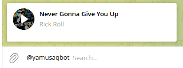
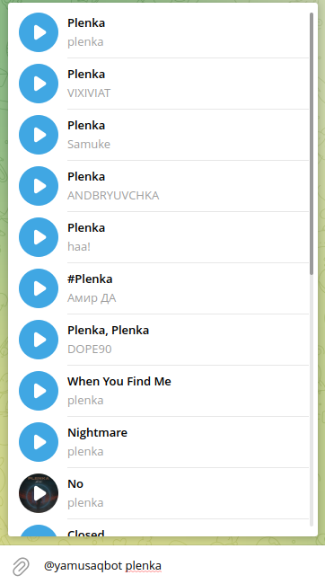

# Yandex Music Telegram Bot

Это бот, который выдаёт MP3 файл с Яндекс Музыки.

## Установка
### Установите зависимости

```bash
$ pip install -r requirements.txt
```

### Измените .env
```bash
$ cp .env.example .env
$ nano .env
```

### Запустите бота
```bash
$ python3 main.py
```
## Инструкция

### Если пользователь ничего не ввёл в качестве запроса, то выдаётся последняя песня, которую он слушал.



### Если пользователь ввёл запрос, то выдаётся список песен по этому запросу.



## LICENSE
GNU LESSER GENERAL PUBLIC LICENSE


Файл лицензии расположен здесь: [LICENSE](https://github.com/Aqendo/yandex-music-telegram-bot/blob/main/LICENSE)
